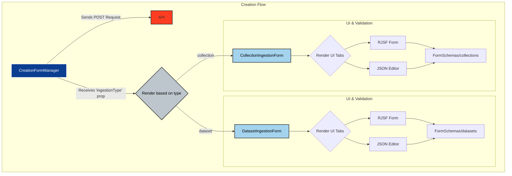
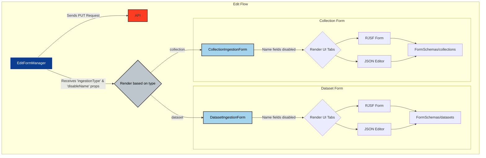

# VEDA Data Ingest

This application is to allow users to create PRs in [veda-data](https://github.com/NASA-IMPACT/veda-data) to ingest data.

## Quick Start

```bash
# Install dependencies
yarn install

# Copy environment configuration
cp .env.example .env

# Start development server
yarn dev
```

## Feature Tour

The latest Playwright test report is published after each merge to `main`. This provides screenshots and descriptions of features in the veda-ingest-ui.
https://nasa-impact.github.io/veda-ingest-ui/

## Tech Stack

- **Framework**: [Next.js](https://nextjs.org/) 15+ with App Router
- **Form Generation**: [react-jsonschema-form](https://github.com/rjsf-team/react-jsonschema-form) for dynamic forms
- **UI Components**: [Ant Design](https://ant.design/) React framework
- **GitHub API**: [@octokit/rest](https://github.com/octokit/rest.js) for GitHub operations
- **Authentication**: Keycloak via NextAuth.js
- **Testing**: Vitest + Playwright for comprehensive testing
- **Deployment**: AWS Amplify with serverless architecture

## 📁 Project Structure

```
├── app/                    # Next.js App Router pages
│   ├── api/               # API routes for GitHub operations and STAC API
│   ├── collections/       # Collection management pages
│   ├── datasets/          # Dataset management pages
│   ├── edit-existing-collection/ # STAC collection editing interface
│   └── upload/            # File upload functionality
├── components/            # Reusable React components
│   ├── ingestion/        # Form components for data ingestion and editing
│   ├── layout/           # Layout components (header, sidebar, etc.)
│   ├── rjsf-components/  # Custom RJSF form components
│   ├── thumbnails/       # Thumbnail upload components
│   └── ui/               # General UI components
├── FormSchemas/          # JSON schemas for form generation
├── hooks/                # Custom React hooks
├── lib/                  # Utility libraries and configurations
├── types/                # TypeScript type definitions
├── utils/                # Helper functions and GitHub utilities
└── __tests__/            # Test suites (unit, integration, e2e)
```

# Architecture

The application supports two primary workflows:

## 1. Data Ingestion

The application allows users to create and edit PRs in the veda-data repository for data ingestion. New PRs are created with a prefix of `'[collection/dataset] Ingest Request for [collectionName]'`. The branch name and file name of the json for these new PRs is set by the Collection Name field in the form after any non-alphanumeric characters are removed from the collection name:

```
const fileName = 'ingestion-data/staging/dataset-config/${collectionName}.json';
const branchName = `feat/${collectionName}`;
```

Users are allowed to edit open PRs that are modifying json files in the standard filepath for each ingestion type. The existing values in the json will be loaded into a form. A user can update those values and a new commit will be added to the PR with the new values.

## 2. Collection Editing

The application also provides direct editing of existing STAC collections through the STAC API. User must have `stac:collection:update` scope for editing permissions.

- **Collection Discovery**: Browse existing collections from `https://staging.openveda.cloud/api/stac/collections`
- **Real-time Editing**: Modify collection metadata directly without GitHub PRs
- **Data Sanitization**: Automatic STAC schema compliance with null-to-array/object conversion and datetime format fixes

## Authentication & Authorization

All API calls require users to be authenticated via Keycloak.

- **GitHub Operations**: Uses GitHub token for repository operations
- **STAC Operations**: Uses access token for STAC API calls with tenant-based permissions
- **Tenant Filtering**: Support for multi-tenant environments with proper access controls

## Creation Component Architecture



## Edit Component Architecture



# Requirements

To set up the development environment for this website, you'll need to install the following on your system:

- [Node](http://nodejs.org/) (see version in [.nvmrc](../.nvmrc)) (To manage multiple node versions we recommend [nvm](https://github.com/creationix/nvm))
- [Yarn](https://yarnpkg.com/) Package manager

If you use [`nvm`](https://github.com/creationix/nvm), activate the desired Node version:

## Installation

Install Node + package manager this repo depends on.

```
nvm install
npm -g install yarn
```

Then install project dependencies by running the yarn install.

```
yarn install
```

## Usage

### Config files

Configuration is done using `.env.` files.

Copy the `.env.example` to `.env` to add your configuration variables.
These variables should also be set in AWS Amplify for the deployment.

```sh
cp .env.example .env
```

### Github Access

A Github access to the veda-data repo is handled by installing the veda-ingest-api app in the veda-data repo's settings and saving the following values as environment variables:

```
INSTALLATION_ID
APP_ID
GITHUB_PRIVATE_KEY
```

## Running the app

To preview the app use:

```
yarn dev
```

This will start the app and make it available at <http://localhost:3000/>.

To bypass the keycloak login, set the `NEXT_PUBLIC_DISABLE_AUTH` environment variable to true. This variable is also leveraged for Playwright testing.

## 🛠️ STAC Data Sanitization

To fix incorrect, previously ingested data, the application includes a data sanitization system to ensure STAC schema compliance:

### Sanitization Features

- **Null Handling**: Converts `null` values to appropriate empty arrays or objects
- **Datetime Format**: Fixes timezone and separator issues (e.g., `+00` → `+00:00`, space → `T`)

### Implementation

Sanitization logic is located in `utils/stacSanitization.ts` and includes:

```typescript
// Main sanitization function
import { sanitizeFormData } from '@/utils/stacSanitization';

const cleanedData = sanitizeFormData(formData);
```

### Field Type Rules

- **Arrays**: `stac_extensions`, `keywords`, `providers`, `links`
- **Objects**: `assets`, `item_assets`, `summaries`
- **Datetime Strings**: Temporal extent fields with format fixes

## Configuring the Validation Form

The fields in the Validation Form are configured by a combination of the json schema in the [jsonschema.json file](FormSchemas/**/jsonschema.json) and the UI Schema in the [uischema.json file](FormSchemas/**/uischema.json). To modify fields in the form, a developer must update the json schema to include the proper JSON schema data fields and then modify the ui Schema to have any new or renamed fields in the desired location.

The Form uses a 24 column grid format and the layout of each row is dictated by the "ui:grid" array in that json. Each row is defined as an object with each field allowed up to 24 columns wide. For example:

```json
  "ui:grid": [
    {
      "collection": 4,
      "title": 4,
      "license": 4,
      "description": 12
    },
    ...
  ]
```

the new first row has 4 fields with a combined width of 24. Nested objects in the field can be defined with their own grid. For example,

```json
  "spatial_extent": {
    "ui:grid": [
      {
        "xmin": 12,
        "ymin": 12
      },
      {
        "xmax": 12,
        "ymax": 12
      }
    ]
  },
```

## Github Destination Repo Configuration

To allow the veda-ingest-ui to open PRs in a repo, a Github app must be installed on the destination repo and several environment variables are needed from that Github app installation. Follow the [Installing your own GitHub App](https://docs.github.com/en/apps/using-github-apps/installing-your-own-github-app) guide from github to get started:

1. Uncheck the "Active" checkbox under webhook. `No webhook is required.`
2. Ensure the app has `Read and Write` permissions to `Contents` and `Pull Requests`.
3. Create and save a Private Key to place in your env variables.
4. Copy the `App ID` and `Client ID` from the new github app's overview.
5. Copy the Installation ID from the repo's list of Installed GitHub Apps. The Installation ID is found in the URL for that application. For example, `https://github.com/settings/installations/[Installation ID]`.
